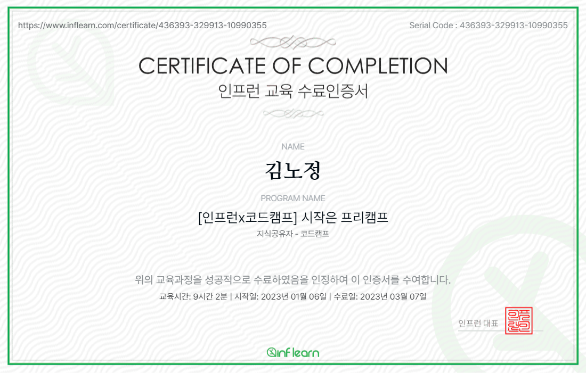

# PRECAMP

## 1. 나만의 싸이월드

## 2. 회원가입 폼 파이널 과제

|                                                                        기능                                                                         |                         구현 여부                         |
| :-------------------------------------------------------------------------------------------------------------------------------------------------: | :-------------------------------------------------------: |
|                              휴대전화 3 - 4 - 4로 구현하기. 앞 칸이 모두 채워지면 다음 칸으로 커서가 이동하도록 하기.                               |                             O                             |
|                    휴대전화 모두 입력하면 인증번호 전송 버튼이 활성화되고, 버튼 누르면 인증번호 보여주기. 3분 타이머도 실행하기.                    | O 휴대전화 모두 입력 시 인증번호 전송 버튼 활성화 제외 |
| 인증확인 버튼 활성화하기. 3분 이내에 버튼 누르면 인증이 완료되었다는 알림창이 표시되어야 하고, 3분이 지나면 인증번호, 타이머, 버튼 모두 초기화하기. |                             X                             |
|                                  가입하기 버튼을 누르면 각 입력칸에 대하여 검증하고, 빈칸 아래에는 경고를 띄우기.                                   |                             X                             |
|                                               검증이 완료되면 가입을 쿡하한다는 알림창을 표시해주기.                                                |                             X                             |

## 3. PRECAMP 인증서 발급

