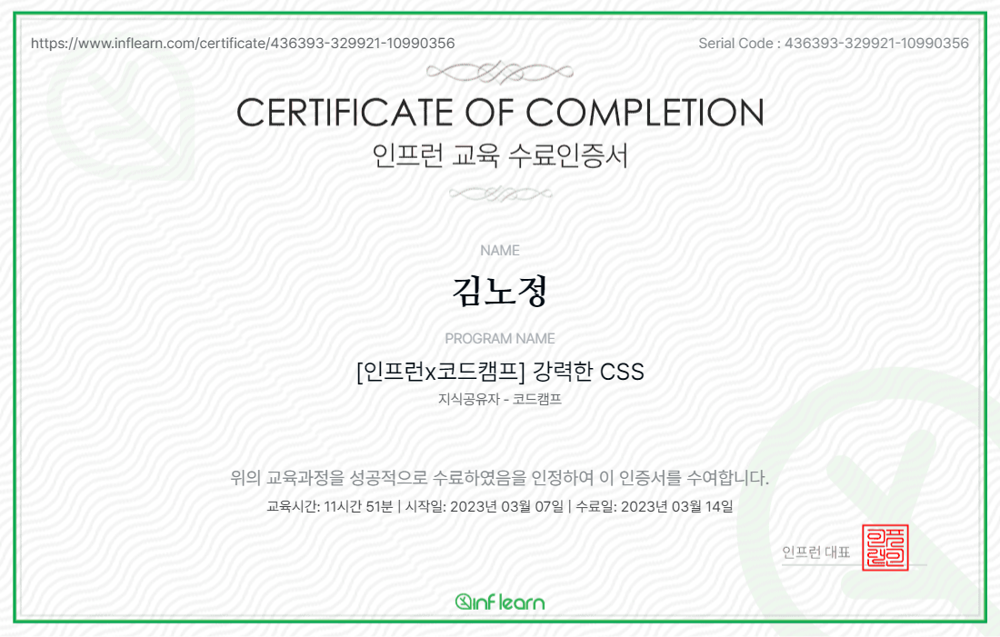

# 강력한 CSS

## 1. 나만의 다이어리 만들기

html와 css를 이용하여 나만의 다이어리를 만들기. css는 주로 flex를 많이 이용하였다.

## 2. 나만의 홈페이지 만들기

|                                        기능                                         | 구현 여부 |
| :---------------------------------------------------------------------------------: | :-------: |
|                          상품을 3 X 4 형태로 잘 배열하기.                           |     O     |
| 마우스를 올렸을 때 살짝 검음 화면 위에 상품 정보를 부드럽게 변화를 주면서 보여주기. |     O     |
|                    해더 만들고 웹사이트 제목에 애니메이션 주기.                     |     O     |
|               메뉴바 만들고, 마우스 올릴 때마다 변화를 부드럽게 주기.               |     O     |
|         웹사이트 가로 사이즈가 작아질 때 상품 정보를 사진 아래에 보여주기.          |     O     |
|            웹사이트 가로 사이즈가 작아질 때 메뉴바를 해더 밑에 붙여주기.            |     O     |

- 레이아웃을 구현할 때에 grid나 flex를 이용하는데 나는 flex를 이용하여 레이아웃을 구현하였다.
- 미디어 쿼리를 이용하여 화면 가로 사이즈에 따라 레이아웃 다르게 지정하기.
- position absolute와 relative를 상황에 맞게 잘 이용하기. 원하는 위치에 원하는 태그들을 지정할 수 있다.

## 3. 강력한 CSS 인증서 발급

