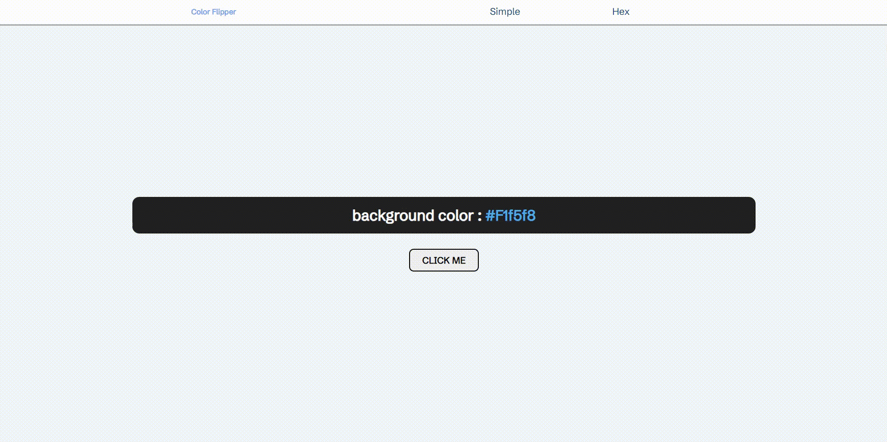

# Color Flipper 만들기

초보자를 위한 40가지 자바스크립트 프로젝트 결과물을 참고하여 Color Flipper를 제작하였다.

|                          기능                          |                                                         구현 방법                                                          | 구현 여부 |
| :----------------------------------------------------: | :------------------------------------------------------------------------------------------------------------------------: | :-------: |
|      결과물과 비슷하게 html와 css 코드 작성하기.       |                                                       flex 이용하기.                                                       |     O     |
| 메뉴바 위의 버튼을 클릭했을 때 컨테이너 내용 변경하기. |                                                   iframe 경로 변경하기.                                                    |     O     |
| 버튼을 클릭하였을 때, 배경 색상과 버튼 색상 변경하기.  | random 함수와 소수점을 없애주는 floor 함수 이용하기. 색상을 브라우저에 보여주기 위하여 style 이용하고, innerText 이용하기. |     O     |
